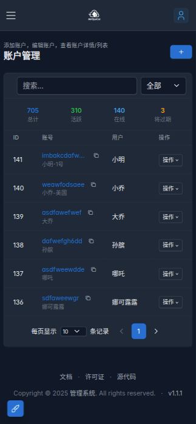

# AirOpsCat 🐱💨

一个轻量、灵活、高效的服务器管理系统，保持敏捷，掌控一切。

[](https://openjdk.java.net/projects/jdk/21/)
[](https://spring.io/projects/spring-boot)
[](LICENSE)
[](https://github.com/fun90/AirOpsCat)

## 📖 项目简介

AirOpsCat 是一个基于 Spring Boot 3.x 构建的现代化服务器管理系统，专为代理服务提供商设计。系统提供了完整的用户管理、服务器管理、节点配置、流量统计和订阅服务等功能，支持多种代理协议和客户端平台。

预览



### 🎯 设计理念
- **简单小巧**: 轻量级架构，快速部署
- **扩展性强**: 模块化设计，易于定制
- **高效稳定**: 基于 Spring Boot 3.x 和 Java 21
- **用户友好**: 现代化 Web 界面，响应式设计

## ✨ 核心特性

### 🔐 用户管理
- 多角色权限控制（管理员、合作伙伴、VIP用户）
- 用户认证与授权
- 登录失败锁定机制
- 用户面板自助服务

### 💰 账户管理
- 账户生命周期管理
- 流量配额与使用统计
- 在线IP监控
- 认证码管理
- 到期时间提醒

### 🖥️ 服务器管理
- 服务器信息管理
- SSH 连接管理
- 配置模板管理
- 自动化部署

### 🌐 节点管理
- 多协议支持（VLESS、Shadowsocks、SOCKS、Hysteria2）
- 节点部署与配置
- 流量统计
- 状态监控

### 📱 订阅服务
- 多平台客户端支持
- 动态配置生成
- 认证码验证
- 实时更新

### 📊 数据统计
- 流量使用统计
- 在线用户监控
- 财务流水记录
- 系统运行状态

### 🔔 通知服务
- Bark 推送通知
- 系统告警
- 用户通知

## 🛠️ 技术栈

### 后端技术
- **框架**: Spring Boot 3.4.4
- **语言**: Java 21
- **数据库**: SQLite + JPA/Hibernate
- **安全**: Spring Security 6.x
- **模板引擎**: Thymeleaf
- **构建工具**: Maven + GraalVM Native Image

### 前端技术
- **UI框架**: Tabler UI 1.3.2
- **响应式**: petite-vue 0.4.1
- **样式**: Bootstrap 5 + CSS3
- **图标**: Tabler Icons

### 核心依赖
- **SSH客户端**: JSch
- **JSON处理**: Jackson
- **工具库**: Apache Commons
- **加密**: Commons Codec
- **映射**: MapStruct

## 🚀 快速开始

### 环境要求
- Java 21 或更高版本
- Maven 3.6+ 或使用项目内置的 Maven Wrapper
- 现代浏览器（Chrome、Firefox、Safari、Edge）

### 方式一：下载预构建版本（jsch兼容问未解决）

从 [GitHub Releases](https://github.com/fun90/AirOpsCat/releases) 下载对应平台的 native 可执行文件：

- **Linux**: `airopscat-linux-amd64.tar.gz`
- **macOS**: `airopscat-macos-amd64.tar.gz`
- **Windows**: `airopscat-windows-amd64.exe.zip`

解压后直接运行，无需安装 Java 环境：

```bash
# Linux/macOS
./airopscat

# Windows
airopscat.exe
```

### 方式二：标准 JAR 构建

```bash
# 克隆项目
git clone https://github.com/fun90/AirOpsCat.git
cd AirOpsCat

# 构建项目
./mvnw clean package

# 运行应用
java -jar target/airopscat-1.0.2.jar
```

### 方式三：Native 可执行文件构建

需要安装 [GraalVM 21](https://www.graalvm.org/downloads/) 和 Native Image：

```bash
# 构建 native 可执行文件
./mvnw -Pnative native:compile

# 运行
./target/airopscat
```

详细的 native 构建说明请参考 [Native Build Guide](docs/native-build-guide.md)。

## ⚙️ 配置说明

### 基础配置

创建 `application.properties` 文件或使用环境变量：

```properties
# 应用基础配置
spring.application.name=AirOpsCat
server.port=8080

# 数据库配置
spring.datasource.url=jdbc:sqlite:admin.db
spring.datasource.driver-class-name=org.sqlite.JDBC

# JPA配置
spring.jpa.database-platform=org.hibernate.community.dialect.SQLiteDialect
spring.jpa.hibernate.ddl-auto=update

# 安全配置
airopscat.crypto.secret-key=your-secret-key-here

# 订阅服务配置
airopscat.subscription.url=http://your-domain.com/subscribe

# SSH配置
airopscat.ssh.provider=jsch

# 在线IP统计配置
airopscat.online.check-minutes=5

# Bark通知配置
airopscat.bark.url=https://api.day.app/YOUR_DEVICE_KEY
airopscat.bark.device-key=your-device-key
```

### 环境变量支持

```bash
export AIROPSCAT_CRYPTO_SECRET_KEY="your-secret-key"
export AIROPSCAT_SUBSCRIPTION_URL="http://your-domain.com/subscribe"
export AIROPSCAT_BARK_URL="https://api.day.app/YOUR_DEVICE_KEY"
```

## 📁 项目结构

```
AirOpsCat/
├── src/main/java/com/fun90/airopscat/
│   ├── AirOpsCatApplication.java          # 应用启动类
│   ├── annotation/                        # 自定义注解
│   ├── config/                           # 配置类
│   │   ├── SecurityConfig.java           # 安全配置
│   │   ├── WebConfig.java                # Web配置
│   │   └── ssh/                          # SSH配置
│   ├── controller/                       # 控制器层
│   │   ├── HomeController.java           # 主页控制器
│   │   ├── AuthController.java           # 认证控制器
│   │   ├── AccountController.java        # 账户控制器
│   │   └── ...
│   ├── model/                           # 数据模型
│   │   ├── entity/                      # 实体类
│   │   ├── dto/                         # 数据传输对象
│   │   ├── enums/                       # 枚举类
│   │   └── vo/                          # 视图对象
│   ├── repository/                      # 数据访问层
│   ├── service/                         # 业务逻辑层
│   │   ├── core/                        # 核心服务
│   │   ├── ssh/                         # SSH服务
│   │   └── xray/                        # Xray服务
│   └── utils/                           # 工具类
├── src/main/resources/
│   ├── static/                          # 静态资源
│   │   ├── css/                         # 样式文件
│   │   ├── js/                          # JavaScript文件
│   │   └── img/                         # 图片资源
│   ├── templates/                       # 模板文件
│   │   ├── fragments/                   # 页面片段
│   │   └── subscription/                # 订阅模板
│   └── application.properties           # 配置文件
├── docs/                               # 文档目录
├── logs/                               # 日志目录
└── pom.xml                             # Maven配置
```

## 🔧 API 接口

### 认证接口
- `POST /api/login/auth` - 用户登录
- `POST /api/logout` - 用户登出

### 用户管理接口
- `GET /api/admin/users` - 获取用户列表
- `POST /api/admin/users` - 创建用户
- `PUT /api/admin/users/{id}` - 更新用户
- `DELETE /api/admin/users/{id}` - 删除用户

### 账户管理接口
- `GET /api/admin/accounts` - 获取账户列表
- `POST /api/admin/accounts` - 创建账户
- `PUT /api/admin/accounts/{id}` - 更新账户
- `GET /api/admin/accounts/stats` - 获取账户统计

### 服务器管理接口
- `GET /api/admin/servers` - 获取服务器列表
- `POST /api/admin/servers` - 创建服务器
- `PUT /api/admin/servers/{id}` - 更新服务器

### 节点管理接口
- `GET /api/admin/nodes` - 获取节点列表
- `POST /api/admin/nodes` - 创建节点
- `PUT /api/admin/nodes/{id}` - 更新节点
- `POST /api/admin/nodes/{id}/deploy` - 部署节点

### 订阅接口
- `GET /subscribe/{authCode}/{osName}/{appName}` - 获取订阅配置

### 通知接口
- `POST /api/bark/notify` - 发送Bark通知
- `GET /api/bark/status` - 获取通知状态

## 🌐 支持的客户端

### Android/HarmonyOS
- **Clash Meta for Android**
- **Clash Meta for HarmonyOS**

### iOS
- **Shadowrocket**
- **Stash**
- **Loon**

### Windows/macOS/Linux
- **Clash Verge**

## 🔒 安全特性

- Spring Security 集成
- 基于角色的访问控制 (RBAC)
- 密码加密存储 (BCrypt)
- 登录失败锁定机制
- CSRF 防护
- 会话管理
- 敏感数据加密

## 📊 监控与日志

### 日志配置
- 日志文件自动轮转
- 按日期分割日志
- 可配置日志级别
- 结构化日志输出

### 系统监控
- 在线用户统计
- 流量使用监控
- 服务器状态监控
- 节点健康检查

## 🚀 部署指南

### Docker 部署（未测试）

```dockerfile
FROM openjdk:21-jre-slim
COPY target/airopscat-1.0.2.jar app.jar
EXPOSE 8080
ENTRYPOINT ["java", "-jar", "/app.jar"]
```

### 系统服务部署

使用项目提供的 systemd 服务文件：

```bash
# 复制服务文件
sudo cp src/main/assembly/bin/setup-systemd.sh /usr/local/bin/
sudo chmod +x /usr/local/bin/setup-systemd.sh

# 安装服务
sudo /usr/local/bin/setup-systemd.sh
```

### 反向代理配置

#### Nginx 配置示例

```nginx
server {
    listen 80;
    server_name your-domain.com;
    
    location / {
        proxy_pass http://localhost:8080;
        proxy_set_header Host $host;
        proxy_set_header X-Real-IP $remote_addr;
        proxy_set_header X-Forwarded-For $proxy_add_x_forwarded_for;
        proxy_set_header X-Forwarded-Proto $scheme;
    }
}
```

## 🤝 贡献指南

我们欢迎所有形式的贡献！

### 开发环境搭建

1. Fork 项目
2. 创建功能分支 (`git checkout -b feature/AmazingFeature`)
3. 提交更改 (`git commit -m 'Add some AmazingFeature'`)
4. 推送到分支 (`git push origin feature/AmazingFeature`)
5. 创建 Pull Request

### 代码规范

- 遵循 Java 编码规范
- 使用 Lombok 简化代码
- 添加适当的注释
- 编写单元测试

### 提交规范

```
feat: 新功能
fix: 修复bug
docs: 文档更新
style: 代码格式调整
refactor: 代码重构
test: 测试相关
chore: 构建过程或辅助工具的变动
```

## 📝 更新日志

### v1.0.2 (最新)
- 新增用户面板功能
- 优化在线IP统计
- 增强Bark通知服务
- 改进订阅模板系统
- 修复已知问题

### v1.0.1
- 添加多协议支持
- 优化SSH连接管理
- 改进安全配置

### v1.0.0
- 初始版本发布
- 基础功能实现

## 📄 许可证

本项目采用 MIT 许可证 - 查看 [LICENSE](LICENSE) 文件了解详情。

## 🙏 致谢

- [Spring Boot](https://spring.io/projects/spring-boot) - 优秀的Java框架
- [Tabler UI](https://tabler.io/) - 现代化的UI组件库
- [petite-vue](https://github.com/vuejs/petite-vue) - 轻量级Vue.js
- [GraalVM](https://www.graalvm.org/) - Native Image支持

## 📞 联系我们

- **项目地址**: [https://github.com/fun90/AirOpsCat](https://github.com/fun90/AirOpsCat)
- **问题反馈**: [Issues](https://github.com/fun90/AirOpsCat/issues)
- **讨论交流**: [Discussions](https://github.com/fun90/AirOpsCat/discussions)

---

⭐ 如果这个项目对您有帮助，请给我们一个星标！

