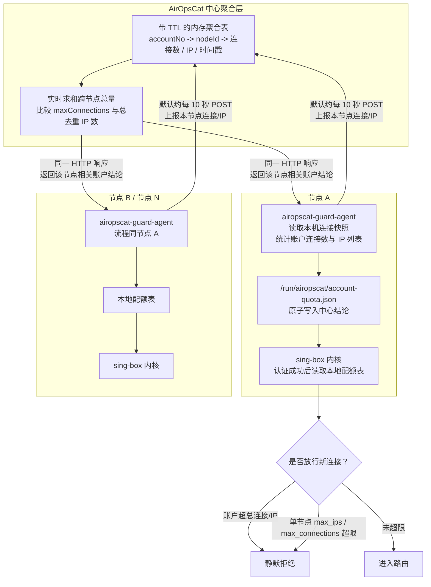

# 账户防共享方案：跨节点总量限制 + sing-box 内核准实时拒绝

## 1. 背景与目标

### 1.1 目标

防止一个账户被多人共享使用。判定与限制的对象是**账户在其所有 sing-box 节点上
的总量**，而不是单个节点上的数量：

- **总连接数**：账户跨所有节点的活跃连接总数不超过 `maxConnections`。
- **总 IP 数**：对活跃连接按客户端 IP 去重后，账户跨所有节点的不同 IP 总数
  不超过限制。

这里的跨节点总量限制是**准实时抑制**，不是强一致的瞬时硬上限。中心结论依赖
agent 周期性上报，因此在一个同步窗口内，账户可能短暂创建超过 `maxConnections`
的连接；下一次上报聚合后，后续新连接才会被本地配额表拒绝。单节点
`max_connections` 兜底只保证单节点内不超，不能单独保证跨节点总量严格不超。

> `maxConnections` 的语义保持不变，仍然是「连接数」。IP 数是对连接按客户端
> IP 去重后的派生指标，二者共用同一份实时连接数据。

### 1.2 核心矛盾：单内核视角 vs 跨节点总量

这是整个方案的设计前提，必须先讲清楚：

- **单个 sing-box 内核只知道自己节点上的连接**。它无法感知同一账户在其他节点
  上还有多少连接 / IP。
- 因此，**内核自身只能做「单节点限制」**，无论怎么写都管不到跨节点总量。
- **只有 AirOpsCat（中心聚合层）拥有全局视图**，能算出账户在所有节点上的总连
  接数和总去重 IP 数。

举例说明「静态给每个节点分配配额」为什么解决不了：账户总限制 3 连接，分布在 3
个节点。若每节点各配 1，用户在单节点开 3 条就被误拦（总数其实没超）；若每节点
各配 3，总数可能冲到 9。**静态的单节点上限无法表达一个动态的跨节点总量。**

### 1.3 为什么纯应用层「事后断连」不够

此前尝试过纯应用层方案（AirOpsCat 定时读取 Clash API 连接列表，对超额连接调用
`DELETE /connections/{id}` 断连，见 git commit `111b7e6`，已回退），根本缺陷：

- **被动、事后**：sing-box 持续接受新连接，应用层踢掉一批，客户端立即重连，
  形成拉锯，无法真正「禁止」。
- **延迟大**：依赖 SSH 轮询采集周期（现为分钟级），共享行为在两次采集之间不受
  任何约束。

### 1.4 已确认的架构决策

| 决策项 | 结论 |
|--------|------|
| 执行架构 | AirOpsCat 聚合全局总量，默认**每 ~10 秒**把「各账户是否已超总限」同步到各节点；sing-box 认证时读本地配额表决定是否拒绝新连接 |
| 同步通道 | **单次请求往返**：agent 默认每 ~10 秒 `POST` 上报本节点数据，中心在**同一响应**里回该节点相关账户的全局聚合结论。少一半请求、数据天然对齐（配额基于「含本次上报在内」的最新聚合） |
| 中心聚合态 | 中心维护**带 TTL 的内存聚合表**（`accountNo → nodeId → 本节点连接/IP + 时间戳`）；每次上报只更新对应节点那一格，实时求和；节点超 TTL 未上报则其数据视为 0，防已下线节点旧数据永久累加 |
| 节点侧载体 | **独立 agent** 负责上报本节点数据 + 接收配额并写本地文件；sing-box 内核只**读本地文件**，不直接与 AirOpsCat 通信 |
| 内核单节点兜底 | **保留**。sing-box 额外支持单节点 `max_ips` / `max_connections` 硬上限，防单点被打爆，与跨节点总量配额是两道独立闸门 |
| 超额新连接处置 | 静默关闭连接（不返回可识别错误，避免客户端据此调整绕过） |
| 限制维度 | `maxConnections` 语义仍为连接数；IP 数为去重派生指标；两者都参与判定 |

### 1.5 数据流总览

现有链路是「AirOpsCat 主动 SSH 拉取」，分钟级、开销重，无法支撑秒级同步。
新方案把热路径数据流**反过来，改为节点推 + 中心下发**，SSH 退出热路径：



| 环节 | 做什么 | 关键约束 |
|------|--------|----------|
| 节点 agent → AirOpsCat | 上报本节点按账户聚合后的连接数和客户端 IP 列表 | 默认约每 10 秒一次，SSH 不在热路径 |
| AirOpsCat 中心 | 更新该节点分格，实时计算账户跨节点总连接数和总去重 IP 数 | 节点数据带 TTL，超时未上报则视为 0 |
| AirOpsCat → 节点 agent | 在同一 HTTP 响应中返回该节点相关账户的超限结论 | 结论基于「含本次上报在内」的最新聚合 |
| 节点 agent → 本地文件 | 原子写 `/run/airopscat/account-quota.json` | tmpfs，本地读，无网络依赖 |
| sing-box 内核 | 认证成功后读取本地配额表，并叠加单节点兜底限制 | 超总限或单节点超限则静默拒绝，否则放行 |

关键点：
- **一次请求往返完成上报 + 取配额**。上报与下发合并为一个 `POST`，请求数减半，
  且响应里的配额基于「含本次上报在内」的最新聚合，不存在「刚报完却拿到上一轮
  配额」的时间错位。
- **中心用带 TTL 的内存聚合表**。每个账户按节点分格存储，收到上报只更新对应节点
  那一格并实时求和；某节点超 TTL 未上报，其数据视为 0，避免已下线节点旧数据被
  永久累加进总量导致误判。
- **sing-box 内核不发起任何网络请求**，只读本地 `account-quota.json`（tmpfs），
  认证热路径零额外 IO 阻塞；网络交互全部由独立 agent 承担。

## 2. 现有基础设施盘点

### 2.1 用户级限速（commit `0bd8443b`）—— 内核植入模式模板

该功能建立了可直接照搬的「按用户维度管控」骨架：

1. **配置字段载体**：`option/inbound_user.go` 的 `InboundUserSpeedOptions`
   通过 Go 匿名内嵌进每个协议的 User 结构，所有协议自动获得字段。
2. **按用户聚合的管控对象**：`common/ratelimit/`，每个 inbound 在 `NewInbound`
   时构建 `userLimiters []*ratelimit.Limiters`，下标与用户下标对齐。
3. **inbound 注入点**：各协议 `newConnectionEx` / `NewConnectionEx` 在认证拿到
   `userIndex` 后、`RouteConnectionEx` 前注入 limiter。
4. **连接元数据字段**：`adapter/inbound.go` 的 `InboundContext` 已含 `User`、
   `Source`（客户端地址含 IP）、限速器字段。

单节点兜底（3.4）完全复用此模式；跨节点配额判断（3.3）在同一注入点增加一次
本地表查询。

### 2.2 guard agent —— 节点侧 agent 模板

节点侧采用独立 `airopscat-guard-agent`：

- systemd 常驻进程，按间隔读本机 `127.0.0.1:${port}/connections`（Clash API）。
- 按账户聚合连接数与去重 IP，通过 `guard-sync` 上报中心并取回全局配额结论。
- 同一次 `/connections` 结果还生成 `onlineAccountIps` 在线 IP 聚合记录，由中心写入
  `account_online_ip`，继续支撑按账户、节点、服务器三个维度的在线查询。
- `onlineAccountIps.connections` 为可选连接引用，默认不发送；需要为后续按连接关闭
  预热数据时，可开启 `guard_include_connection_refs`，携带 `connectionId` 与 `start`。
- `guard-sync` 请求体使用 gzip 压缩上传，HTTP 头带 `Content-Encoding: gzip`，减少
  JSON 字段名和重复 IP/账号带来的网络开销。
- 原子写 `/run/airopscat/account-quota.json`（tmpfs），带 `schemaVersion`
  + `generatedAt` + `ttlSeconds`，内核据此判断数据新鲜度。
- 使用 systemd 安装 / 重启 / 排错，不依赖旧在线连接快照文件。

防共享 guard 与旧在线连接快照功能解耦；当前落地脚本直接安装
`airopscat-guard-agent.service`，不再要求节点生成 `/run/airopscat/online-connections.json`。

### 2.3 AirOpsCat 侧现有能力

- **全局在线视图已存在**：`account_online_ip` 表每条记录带 `node_ip`，
  `AccountOnlineIpService.getOnlineRecordsByAccountNos` 已是跨节点聚合查询，
  `AccountOnlineLimitAlertService.buildSummary` 已在统计「去重客户端 IP 数」。
  这正是跨节点总量的现成数据基础。
- **节点上报入口已存在**：`ClientController`（`/api/client`）+ `ClientRequest`
  （`accountNo` / `clientIp`），当前用于在线状态上报，可扩展承载 agent 上报。
- **下发链路已存在**：`SingBoxConfigBuilder.putRateLimitFields` 向 user JSON
  写 `download_mbps`；`NodeClient` record 携带下发字段；`RateLimitService`
  提供 override 机制。单节点 `max_ips` 兜底走同一条链路。
- **采集调度**：`account-online-refresh` 任务为 `interval-minutes` 类型
  （cron `0 */N * * ?`），**最快每分钟一次**。这条链路继续用于分钟级的告警与
  观测，**不承载秒级配额同步**（秒级链路走 agent 推 / 拉，见 §4）。

### 2.4 关键机制确认

- `metadata.Source.Addr()` 提供客户端 IP。
- 各协议 inbound 的 `newConnectionEx` / `NewConnectionEx` 接收 `onClose
  N.CloseHandlerFunc`，连接关闭时触发，是单节点 IP 计数**回收**挂载点。
- 拒绝连接：`N.CloseOnHandshakeFailure(conn, onClose, err)`，各协议认证失败时
  已在用。
- QUIC 系（hysteria2、tuic）在 `NewConnectionEx` 层同样能拿到 `source` 与
  `onClose`，multiplex 的 stream 已收敛为逻辑连接，**无需为 QUIC 特殊处理**。

## 3. sing-box 内核层设计

内核层承担两件事：**(A) 读中心下发的跨节点配额表，对已超总限的账户拒绝新连接；
(B) 单节点 `max_ips` / `max_connections` 硬上限兜底。** 两者是独立闸门，任一
命中即拒绝。

### 3.1 配置字段（单节点兜底 + 配额表路径）

`option/inbound_user.go` 增加单节点兜底字段（零值即不限制、无开销）：

```go
type InboundUserSpeedOptions struct {
    DownloadMbps   float64 `json:"download_mbps,omitempty"`
    UploadMbps     float64 `json:"upload_mbps,omitempty"`
    MaxIPs         int     `json:"max_ips,omitempty"`         // 单节点去重 IP 上限（兜底）
    MaxConnections int     `json:"max_connections,omitempty"` // 单节点连接数上限（兜底）
}
```

跨节点配额表路径**不作为 inbound 配置字段**，而是采用固定约定路径 + 环境变量覆盖
（实现落地时的工程简化）：

```go
// common/accountquota 包内约定
const (
    DefaultPath = "/run/airopscat/account-quota.json"
    EnvPath     = "AIROPSCAT_ACCOUNT_QUOTA_FILE" // 需要时用环境变量覆盖默认路径
)
```

> **为什么不做成 inbound 配置字段**：配额表是节点级共享资源（所有 inbound 读同一份
> 文件），若做成 per-inbound 字段需要给 9 个协议的 `*InboundOptions` 逐个加字段并在
> 配置里重复填写，冗余且易漏。改用进程级固定路径后，`accountquota.Global()` 提供
> 全局单例 Guard，所有协议 inbound 共享同一份加载结果与后台重载 goroutine。
> 文件不存在时（未启用防共享 / agent 未部署）Guard 自动 fail-open，语义自然。

> `max_ips` / `max_connections` 是 AirOpsCat 与 sing-box 的 JSON 契约，需先定死
> 再对接下发。命名 `max_ips` 明确「IP 数」，`max_connections` 明确「连接数」。

### 3.2 配额表格式（agent 写，内核读）

`/run/airopscat/account-quota.json`（tmpfs，原子写，带 TTL）：

```json
{
  "schemaVersion": 1,
  "generatedAtEpochSeconds": 1778640000,
  "ttlSeconds": 30,
  "blockedAccounts": {
    "A10001": { "reason": "connections", "total": 12, "limit": 10 },
    "A10002": { "reason": "ips", "total": 4, "limit": 3 }
  }
}
```

- 只列**已判定超总限的账户**（黑名单语义），表通常很小。
- `reason` 区分是超连接数还是超 IP 数，供内核日志与后续策略使用。
- `ttlSeconds`：内核读表时若已过期（agent 挂了、同步中断），**按「放行」处理**
  （fail-open），避免中心故障导致全量拒绝。这是安全性与可用性的权衡，见 §6。

### 3.3 内核读配额表 + 拒绝逻辑

新增 `common/accountquota/` 包，负责加载、缓存、热更新配额表：

```go
package accountquota

// Guard 周期性从 file 加载配额表，提供 O(1) 查询。
type Guard struct {
    // 内部：atomic.Pointer[snapshot]，snapshot 含 blocked map + 过期时间
}

// NewGuard 启动后台 goroutine（或由 inbound 触发的懒加载 + mtime 检查）加载 file。
// file 为空则返回 nil（不启用跨节点配额）。
func NewGuard(ctx context.Context, file string) *Guard { /* ... */ }

// Blocked 返回该账户是否已被中心判定超总限；表过期或不存在时返回 false（fail-open）。
func (g *Guard) Blocked(accountNo string) (bool, string) { /* ... */ }
```

各协议 inbound 在认证成功、拿到 `user`（账户号）后、路由前查询：

```go
// 1) 跨节点总量配额（中心下发）
if g := h.accountGuard; g != nil {
    if blocked, reason := g.Blocked(user); blocked {
        h.logger.InfoContext(ctx, "[", user, "] rejected: over global ", reason)
        N.CloseOnHandshakeFailure(conn, onClose, os.ErrPermission) // 静默
        return
    }
}
// 2) 单节点兜底（见 3.4）
```

> 配额判断基于「账户号」，与用户下标无关，因此 `accountGuard` 是 inbound 级
> 单例，不需要按用户构建数组。

### 3.4 单节点兜底（复用限速模式）

新增 `common/connlimit/` 包，提供按用户的 IP 引用计数器与连接计数器（同一 IP
的多条连接共享一个 IP 名额）：

```go
package connlimit

import "sync"

type Limiter struct {
    mu             sync.Mutex
    maxIPs         int
    maxConnections int
    ipRefs         map[string]int // key: 客户端 IP；value: 该 IP 活跃连接数
    totalConns     int
}

// New 返回限制器；maxIPs<=0 且 maxConnections<=0 时返回 nil（不限制、无开销）。
func New(maxIPs, maxConnections int) *Limiter { /* ... */ }

// Acquire 尝试为来自 ip 的新连接占名额：
//  - maxConnections>0 且 totalConns 已达上限 → 拒绝
//  - 新 IP 且 maxIPs>0 且不同 IP 数已达上限 → 拒绝
//  - 否则占用（同 IP 引用计数+1，totalConns+1），放行
func (l *Limiter) Acquire(ip string) bool { /* ... */ }

// Release 连接关闭时归还名额（引用计数-1，归零删除；totalConns-1）。
func (l *Limiter) Release(ip string) { /* ... */ }
```

inbound 接入（在 3.3 的配额判断之后）：

```go
if cl := h.userConnLimiters[userIndex]; cl != nil {
    ip := metadata.Source.Addr().String()
    if !cl.Acquire(ip) {
        h.logger.InfoContext(ctx, "[", user, "] rejected: node-local limit, ip=", ip)
        N.CloseOnHandshakeFailure(conn, onClose, os.ErrPermission) // 静默
        return
    }
    onClose = connlimit.WrapOnClose(onClose, cl, ip) // 关闭时 Release
}
```

`WrapOnClose`：

```go
func WrapOnClose(next N.CloseHandlerFunc, l *Limiter, ip string) N.CloseHandlerFunc {
    return func(err error) {
        l.Release(ip)
        if next != nil {
            next(err)
        }
    }
}
```

### 3.5 需改动的协议文件清单

与限速 commit `0bd8443b` 的改动集合基本一致：

- `protocol/vless/inbound.go`
- `protocol/vmess/inbound.go`
- `protocol/trojan/inbound.go`
- `protocol/hysteria2/inbound.go`
- `protocol/hysteria/inbound.go`
- `protocol/tuic/inbound.go`
- `protocol/shadowsocks/inbound_multi.go`
- `protocol/shadowtls/inbound.go`
- `protocol/anytls/inbound.go`

配置侧：`option/inbound_user.go` 增字段即可；各协议 `option/*.go` 因匿名内嵌
无需逐个改用户字段。配额文件路径不进 inbound 配置，走固定约定路径 + 环境变量
（见 §3.1），无需给各协议 options 加字段。

### 3.6 计数与正确性要点

- **回收必达**：`Acquire` 成功后必须保证 `Release` 被调用，统一通过包裹
  `onClose` 实现（所有连接最终都会触发 `onClose`）。`Acquire` 后、包裹
  `onClose` 前若有提前 return 需确保不遗漏回收（review 重点）。
- **fail-open**：配额表过期 / 缺失时按放行处理，中心故障不致全量断网。
- **静默关闭**：用内部错误触发关闭，日志 INFO 级便于观测，不向客户端回传结构化
  拒绝信息。
- **两道闸门独立**：跨节点配额与单节点兜底各自判断，互不依赖。

## 4. AirOpsCat 应用层设计

### 4.1 合并请求：一次往返完成「上报 + 取回配额」

上报与配额下发**合并为同一个 HTTP 请求往返**：agent 在请求体带本节点实时数据，
中心在响应体直接回该节点相关账户的配额结论。相比上行推 + 下行拉两条独立通道：

- **请求数减半**：默认 10 秒一次、N 个节点，合并后往返数减半，中心与网络压力都降。
- **数据天然对齐**：响应里的配额基于「包含本次上报在内」的最新聚合结果，不存在
  「刚报完、但拉到的是上一轮配额」的时间错位。
- **实现简单**：单端点、单次同步往返，agent 侧就是 POST → 拿 response → 原子写
  文件，无需管理两条通道的时序。

新增端点 `POST /api/open/guard-sync`（需鉴权，见文末）。

**请求体**（agent 上报本节点实时快照）：

```json
{
  "nodeIp": "1.2.3.4",
  "generatedAtEpochSeconds": 1778640000,
  "accounts": [
    { "accountNo": "A10001", "connections": 5, "ips": ["9.9.9.9", "8.8.8.8"] }
  ],
  "onlineAccountIps": [
    {
      "accountNo": "A10001",
      "nodeTag": "node_7",
      "clientIps": ["9.9.9.9", "8.8.8.8"],
      "connections": [
        { "clientIp": "9.9.9.9", "connectionId": "abc123", "start": "2026-07-14T10:00:00+08:00" }
      ]
    }
  ]
}
```

其中 `onlineAccountIps.connections` 是可选字段，默认不开启，避免高连接数场景重新回到
逐连接大请求；开启后用于保留 `connectionId` 与 `start`，为后续按连接关闭能力预留。
节点 agent 上传该请求体时使用 gzip 压缩，中心按 `Content-Encoding: gzip` 自动解压。

**响应体**（中心回该节点涉及账户的全局聚合结论）：

```json
{
  "schemaVersion": 1,
  "generatedAtEpochSeconds": 1778640000,
  "ttlSeconds": 30,
  "blockedAccounts": {
    "A10001": { "reason": "connections", "total": 12, "limit": 10 }
  }
}
```

响应体格式与 §3.2 内核读取的 `account-quota.json` 一致——agent 拿到后直接原子
写盘即可，无需二次转换。

> **回结论而非原始数字**：响应只回「该账户是否超总限（blockedAccounts 黑名单）」，
> 而非把 totalConnections/totalIps 全量回给节点让其自行比对。判定逻辑收敛在中心
> 一处，改阈值 / 改算法不用动节点；节点只认黑名单。

### 4.2 中心侧带 TTL 的内存聚合表（合并方案的核心）

中心维护一张「每节点最近上报」的内存表，收到上报即更新对应格并实时求和：

```
Map<accountNo, Map<nodeIp, NodeStat>>
  NodeStat = { connections, ipSet, reportedAtEpochSeconds }
```

`guard-sync` 请求只负责更新快照并返回已经确认的黑名单；中心每 10 秒统一采样一次：

1. **更新**：用请求体覆盖 `聚合表[各accountNo][nodeIp]` 这一格，刷新 `reportedAt`。
2. **中心采样求和**：对每个账户，累加所有节点
   的 `connections`、合并所有节点的 `ipSet` 去重，得到全局 `totalConnections` /
   `totalIps`。
3. **连续判定**：与 `Account.maxConnections`（连接数）及 IP 上限比较；连续超限
   达到配置的采样次数后加入中心黑名单，任一采样周期恢复到限制内时立即移除。
4. **返回**：后续 `guard-sync` 请求把已经确认的黑名单结论回给对应节点 agent。

**每格必须带 TTL**——这是合并方案不出错的关键：

- 某节点若宕机 / 网络中断不再上报，它那一格的旧数据**不能永远累加进总量**，
  否则会把已下线节点的连接数长期算入，导致账户被错误判超限。
- 求和时跳过 `now - reportedAt > TTL`（默认 30 秒，为 10 秒同步周期的 3 倍）的过期格；可由收到新上报时惰性
  剔除，或由一个低频清理任务定期清除。

> 内存表不落库（秒级高频，落库无必要）；中心重启后由 agent 在数个周期内重新
> 上报重建，无需持久化。

### 4.3 中心统一采样任务

中心使用每 10 秒执行一次的 `@Scheduled` 任务统一计算连续超限次数。这样同一周期
内无论收到多少个服务器 agent 上报，每个账户都只累计一次，避免服务器数量改变
连续超限阈值的实际含义。任务使用 `ConcurrentExecution.SKIP` 防止重叠执行。

另有低频（如每 30 秒）任务清理超 TTL 的僵尸节点格，防止长期不上报的节点在表中
堆积；清理任务不参与连续超限次数累计。

### 4.4 单节点兜底字段下发（低频，随部署）

`max_ips` / `max_connections` 单节点兜底是**静态配置**，随节点部署下发，不走
秒级热路径：

1. `NodeClient` record 增加 `Integer maxIps`、`Integer maxConnections`。
2. `SingBoxConfigBuilder.putRateLimitFields` 复用为写入点，向 user JSON 追加
   `max_ips`（落地时未新建 `putConnLimitFields`，与限速字段共用一处）。
3. 填充 `NodeClient` 处，把账户的单节点兜底值映射进去：IP 数兜底取自新增的
   `Account.maxIps`（见 §4.5）。
   单节点兜底值可与跨节点总限相同，也可另设更宽松的倍数，避免误伤单节点重度用户。
4. 配额文件路径无需在 inbound 配置声明：内核用固定约定路径
   `/run/airopscat/account-quota.json`（可用环境变量 `AIROPSCAT_ACCOUNT_QUOTA_FILE`
   覆盖），文件不存在即自动 fail-open。agent 只需把 guard-sync 响应写入该路径。

### 4.5 `maxConnections`（连接数）与 `maxIps`（IP 数）双字段

已确认 **IP 上限独立成字段**（§5.2），账户级限制由两个独立字段承载：

- `Account.maxConnections` **语义不变**（连接数），作为「跨节点总连接数」上限。
- 新增 `Account.maxIps`（去重 IP 数 / 设备数），作为「跨节点总 IP 数」上限。
  需配套 DB 迁移（`db/migration` 加列）、`AccountDto` / `AccountRequest` 字段、
  管理页面表单项与文案。
- 两者都参与 `guard-sync` 判定：任一超限即把账户计入 `blockedAccounts`，
  `reason` 区分 `connections` / `ips`。任一字段为空或 ≤0 表示该维度不限制。

### 4.6 原生镜像反射注册（必查项）

按 `CLAUDE.md`，新增/修改用作控制器请求/响应、Qute 模板参数或经 `JsonUtil`
序列化的类，必须在 `JsonReflectionConfiguration` 注册。本方案新增的上报 DTO、
配额 DTO、`NodeClient` 结构变化等均需确认注册。

### 4.7 分钟级告警继续作为观测层

`AccountOnlineLimitAlertService` 与 `account-online-refresh` 继续运行，作为：

- **观测**：发现配置未下发到位、agent 异常、疑似共享账户，提供运营可见性。
- **新鲜度检查**：确认各服务器 guard 在线明细仍在窗口内上报；默认不再主动 SSH
  采集在线状态。
- **显式回退**：只有开启 `airopscat.account.guard.online-fallback-clash-api-enabled`
  且节点上报过期时，中心才通过 Clash API 临时补采在线状态。

## 5. 关键实现决策（已确认）

### 5.1 节点侧 agent：独立 guard agent（已定）

**决策：部署独立 `airopscat-guard-agent`，不依赖旧连接快照 agent。**

该 agent 周期读取本机 Clash API，统计各账户连接/IP，发 `guard-sync`，并原子写
`account-quota.json`。同一个 `guard-sync` 请求还携带按账号与节点标识聚合的在线 IP
`onlineAccountIps`，中心据此刷新 `account_online_ip`；可选的 `connections` 子字段用于
预留 `connectionId` 与 `start`。旧在线连接快照文件已从
在线刷新链路移除，中心 SSH/Clash API 采集只作为显式开启的过期回退路径。

落地要点：

- agent 每个采集周期（默认 10 秒，可按需调低到 5 秒）读取 `/connections`，按账户聚合出
  `{accountNo → connections + ipSet}`。
- 用该聚合结果和在线 IP 聚合记录发一次 `guard-sync`（§4.1），中心同步刷新
  `account_online_ip`，拿到响应后原子写 `/run/airopscat/account-quota.json`。
- `guard-sync` 请求体先写入临时文件并 gzip 压缩，再通过 `curl --data-binary` 上传，
  避免 shell 变量承载二进制内容。
- systemd 服务定义、安装/重启/排错流程由 `02-guard-agent.sh` 管理。

### 5.2 独立的 IP 上限字段：新增 `Account.maxIps`（已定）

**决策：新增独立的「最大设备/IP 数」字段 `Account.maxIps`，与 `maxConnections`
（连接数）并列，二者独立配置、独立判定。**

- `Account.maxConnections`：跨节点**总连接数**上限，语义不变。
- `Account.maxIps`：跨节点**总去重 IP 数**上限（近似「最大同时在用设备/地点数」），
  防共享的主判据。

需要的配套改动：

1. **DB 迁移**：`account` 表新增 `max_ips` 列（`src/main/resources/db/migration`
   下新增 Flyway 脚本），可空，空 / ≤0 表示不限制。
2. **实体与 DTO**：`Account` 实体、`AccountDto`、`AccountRequest` 增加 `maxIps`；
   `NodeClient` record 增加 `Integer maxIps`（单节点兜底下发用）。
3. **管理页面**：账户编辑页新增「最大 IP / 设备数」输入项（与「最大连接数」并列），
   沿用现有 Tabler 表单组件。
4. **判定接入**：§4.2 聚合判定时，`totalConnections` 比 `maxConnections`、
   `totalIps` 比 `maxIps`，任一超限即拉黑（`reason` 区分 `connections` / `ips`）。
5. **反射注册**：改动的 DTO / record 在 `JsonReflectionConfiguration` 复核（§4.6）。

> `maxIps` 同时用于两处：跨节点总量判定（中心，主判据）与单节点兜底下发
> （sing-box `max_ips`，见 §3.1 / §4.4）。两者取值可相同，也可为单节点兜底设更
> 宽松的值，具体映射在填充 `NodeClient` 时决定。

## 6. 风险与权衡

| 风险 | 说明 | 缓解 |
|------|------|------|
| 中心故障导致全量拒绝 | `guard-sync` 请求失败 / 无响应，本地表得不到刷新而过期 | 内核 fail-open：表过期即放行，中心故障不断网 |
| 同步窗口内的短暂超额 | 同步有延迟，账户可在一个周期内短暂超总限。例如限制 3，节点 A / B 在下一次上报前分别新建连接，中心尚未下发 blocked 结论时，这些连接会先被放行 | 目标是「防持续共享」而非「零超额」；缩短同步周期、降低单节点 `max_connections` 兜底值，或改为中心同步授权才能进一步收紧 |
| CGNAT / 大内网出口 | 多设备共用一个公网 IP，IP 去重后算 1 个 | 安全方向偏差（宁漏放不误杀），可接受；连接数维度仍能约束 |
| 移动网络 IP 切换 | 单设备漫游产生多 IP | 限额留冗余；旧连接关闭后 IP 从统计中消失 |
| 上报端点被伪造 | 恶意上报可篡改聚合结果 | 端点鉴权（节点密钥 / mTLS） |
| 内存聚合丢失 | 中心重启丢失聚合态 | 由 agent 在下一个同步周期重新上报重建，无需持久化 |
| agent 与内核数据不一致 | agent 统计与内核实际连接有偏差 | 均以本机 Clash API 为源；偏差在一个同步周期内收敛 |
| 单节点计数泄漏 | 兜底 `Acquire` 后未 `Release` | 统一包裹 `onClose` 回收；单元测试覆盖异常路径 |

## 7. 落地顺序与分工

存在契约依赖，建议顺序：

1. **定契约**：
   - sing-box：`max_ips` / `max_connections`（单节点兜底）用户字段；
     配额文件固定路径（默认 `/run/airopscat/account-quota.json`，环境变量
     `AIROPSCAT_ACCOUNT_QUOTA_FILE` 可覆盖）；`account-quota.json` 格式（§3.2）。
   - AirOpsCat ↔ agent：`guard-sync` 单请求的请求体（本节点上报）与响应体
     （全局聚合结论）格式（§4.1）。
2. **内核开发**（sing-box）：
   - `option/inbound_user.go` 增字段 → `common/accountquota/`（读配额表 +
     fail-open）→ `common/connlimit/`（单节点兜底）→ 各协议 inbound 接入 →
     单元测试（配额命中拒绝、fail-open、引用计数、并发安全）。
3. **agent 开发**（节点侧，优先扩展快照 agent）：
   - 统计本节点各账户连接/IP → 一次 `guard-sync` 请求（带本节点数据）→
     从响应取全局结论 → 原子写 `account-quota.json`。
4. **中心开发**（AirOpsCat）：
   - **数据模型先行**：`account` 表 `max_ips` 列 Flyway 迁移 → `Account` 实体、
     `AccountDto`、`AccountRequest`、`NodeClient` 增 `maxIps`（§5.2）。
   - `guard-sync` 端点（含鉴权）更新该节点在内存聚合表中的格；中心定时任务统一
     求和（剔除超 TTL 的僵尸节点格），按 `maxConnections` / `maxIps` 双维度执行
     连续超限判定；后续同步响应返回已确认黑名单 → 低频清理任务 → 单节点兜底字段下发（`NodeClient` +
     `SingBoxConfigBuilder`）→ 反射注册 → 账户页新增「最大 IP / 设备数」输入项。
5. **联调验证**：
   - 同账户在**多个节点**合计超过 `maxConnections` → 新连接被内核静默拒绝；
   - 跨节点去重 IP 数超限 → 新 IP 连接被拒；
   - 单节点 `max_ips` 兜底：单节点内超限即拒（不依赖中心）；
   - 中心停机 → 表过期 → 内核 fail-open 放行，不断网；
   - 恢复后在一个同步周期内配额重新生效。

## 8. 附：与已回退应用层方案（`111b7e6`）的关系

- 「保留最早、断开最新」：本方案在总量达标后拒绝**新**连接，天然保留既有连接，
  无需显式排序。
- 「连续超限阈值」：中心聚合是准实时精确计数，抖动小；如需可在配额计算时加
  平滑（连续 N 个周期超限才拉黑），比原方案的采集抖动可控。
- 「失败隔离」：内核单连接拒绝互不影响；单节点 agent 故障只影响该节点上报，
  中心剔除其数据后继续服务其他节点。
- 断连能力可作为**应急兜底开关**保留，不再是主力。
