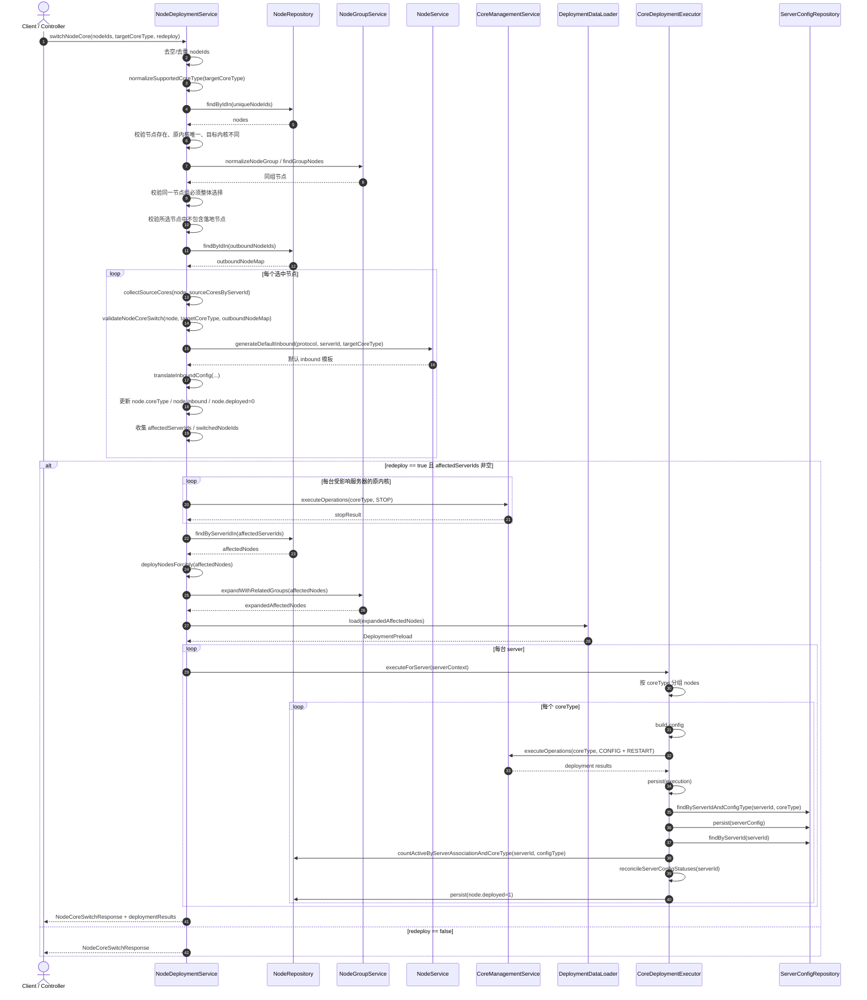
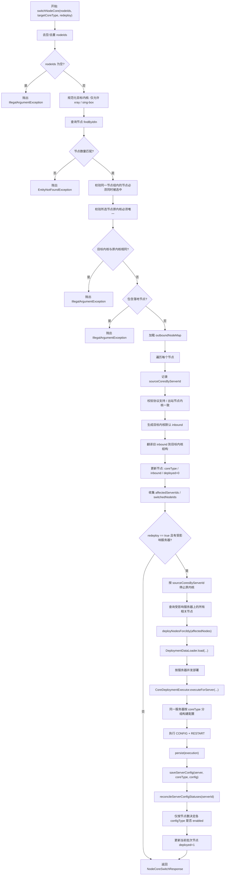

# `NodeDeploymentService#switchNodeCore` 时序与流程图

> 历史废弃文档：当前主线已经移除内核变更功能，`switchNodeCore` 相关 API、DTO 和服务流程不再作为现行实现依据。本文仅保留用于理解旧版本迁移背景。

本文描述旧版本代码中 `com.fun90.airopscat.service.deployment.NodeDeploymentService#switchNodeCore` 的执行链路，基于以下历史实现整理：

- `src/main/java/com/fun90/airopscat/service/deployment/NodeDeploymentService.java`
- `src/main/java/com/fun90/airopscat/service/deployment/CoreDeploymentExecutor.java`

## 1. 时序图



## 2. 流程图



## 3. 关键节点说明

- 该方法不是只改 `Node.coreType`，还会同步翻译并覆盖 `Node.inbound`，同时把节点重新标记为 `deployed = 0`。
- 当前实现会先通过 `NodeGroupService` 校验所选节点，如果某个节点属于节点组，则必须整组一起切换。
- 历史实现曾显式禁止落地节点切换内核，避免影响把这些落地节点作为出站节点使用的代理节点。
- 历史实现不再在切换内核过程中联动更新路由规则，因为路由规则只依赖落地节点，而当时已经禁止落地节点切换内核。
- 如果 `redeploy = true`，重部署范围不是“仅本次切换的节点”，而是“所有受影响服务器上的相关节点”，并且会继续按节点组展开。
- 重部署时会先停原内核，再按服务器和 `coreType` 分组重新下发配置。
- `ServerConfig.enabled` 的最终状态不是在 `switchNodeCore` 中直接处理，而是在 `CoreDeploymentExecutor.saveServerConfig(...)` 后通过 `reconcileServerConfigStatuses(...)` 按节点数统一收敛。

## 4. 当前实现的简化伪代码

```text
switchNodeCore(nodeIds, targetCoreType, redeploy):
  1. 校验参数和目标内核
  2. 查询节点并校验:
     - 所有节点存在
     - 同组节点必须整体选择
     - 原内核唯一
     - 目标内核与原内核不同
  3. 遍历节点:
     - 校验协议和出站依赖
     - 翻译 inbound
     - 更新 coreType / inbound / deployed
     - 收集受影响服务器
  4. 如果 redeploy:
     - 停止原内核
     - 查询受影响服务器上的全部相关节点
     - 按节点组展开后执行强制重部署
  5. 返回响应
```
